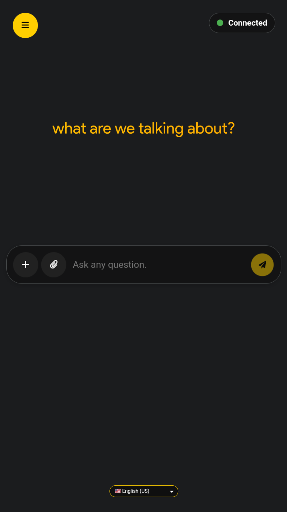

# MirAI

**A simple, lightweight, and responsive web interface to interact directly with the Google Gemini API.**

 

  

---

## ✨ Key Features

MirAI is designed to be an accessible and feature-rich AI chat companion, right from your browser.

* **💾 Session Persistence:** Your conversation is automatically saved in your browser. Pick up where you left off, anytime!
* **✅ Responsive Chat Interface:** A comfortable layout for both mobile and desktop use.
* **🌗 Light & Dark Mode:** Switch themes according to your visual preference.
* **🎭 Customizable AI Persona:** Choose between Default (Relaxed & Casual), Formal, or Creative personalities for the AI.
* **🌐 Multi-language Support:** Available in Indonesian, English (US & UK), and Japanese.
* **🔑 API Key Configuration:** Enter your own Gemini API key directly from the settings menu.
* **🚀 Enhanced Slash Commands & Tools Menu:** Use the '+' menu or type commands like `/translate`, `/summarize`, `/code`, and `/fix` for specific tasks.
* **🖼️ Multimodal Input:** Support for image uploads (JPEG, PNG, WebP) along with your text prompts, powered by Gemini's multimodal capabilities. 
* **🔊 Text-to-Speech (TTS):** Click the speaker icon to have the AI's response read aloud in the selected language.
* **🛑 Stop Generation:** Immediately halt the AI's response when needed.
* **📝 Markdown Parsing:** Responses from the AI containing formatting (like code blocks and lists) will be displayed correctly.
* **⏰ Time-aware Context:** The AI knows the current date and time for more relevant answers.
* **📤 Backup & Restore:** Export your chat history and settings to encrypted `.medf` or plain `.mdf/.json` files, and import them later or on another device.
* **📲 Progressive Web App (PWA):** Install MirAI as a native-like app on your device (Android, iOS, desktop) with offline capabilities.
* **🔒 Encrypted Config System:** Secure `.medf` file format with authenticity signatures for API key storage and data backup.
* **⚠️ Public API Usage Limits:** Intelligent tracking and warnings for public API key usage to ensure fair usage.
* **🔧 Dynamic Slash Command Suggestions:** Real-time command suggestions as you type `/` commands.
* **📋 One-Click Copy:** Easily copy AI responses to clipboard with proper attribution.
* **🌐 Connection Status Indicator:** Visual indicator showing online/offline status.
* **🔄 Model Switching:** Support for both Gemini 2.5 Flash (stable) and Gemini 3 Flash Preview (beta) models via URL parameters.
* **🔐 Authenticity Verification:** Built-in signature verification for backup files to ensure they're genuine MirAI backups.

---

## 🎨 UI/UX Design

The visual design and user experience of MirAI are powered by:

  

**SuperRoundedUI (SRUI)**

An exclusive UI design system from Allwaysever™ that emphasizes rounded corners, smooth transitions, and a clean layout.
**("Flat never felt this round.")**

---

## 🚀 Try MirAI now!

You can try MirAI right away without any installation needed!

* **<a href="https://allwaysevermirai.netlify.app" target="_blank" rel="noopener noreferrer">➡️ Try the Web Version (Netlify)</a>**
* **<a href="https://minhaskamal.github.io/DownGit/#/home?url=https://github.com/Allwaysever/MirAI/blob/main/index.html" target="_blank" rel="noopener noreferrer">⬇️ Download HTML File (Offline Version)</a>**
* **<a href="https://allwaysevermirai.netlify.app?pwa=true" target="_blank" rel="noopener noreferrer">📱 Install as PWA</a>**
* **<a href="https://allwaysevermirai.netlify.app?betamodel=true" target="_blank" rel="noopener noreferrer">🧪 Try Beta Model (Gemini 3 Flash Preview)</a>**

---

## 🛠️ Setup (Using Your Own API Key)

For the best performance and security, it is highly recommended to use your own Google Gemini API Key.

<strong>➡️ Click here for a complete tutorial on obtaining an API Key.</strong>

 

### Step 1: Get Your API Key
1.  Open **Google AI Studio** at [https://aistudio.google.com/](https://aistudio.google.com/).
2.  Sign in with your Google account.
3.  Click **"Get API Key"** in the sidebar.
    
    
4.  Then, click **"Create API key"**.
    
5.  Type "Gemini API" and click "Create API key in existing project".
    
6.  Copy the generated API Key.
    

### Step 2: Enter the API Key in MirAI
Simply enter the key through the settings menu within the application.
1.  Open the `MirAI.html` file or [MirAI Web](https://allwaysevermirai.netlify.app). 
2.  Click the **menu icon** in the top-left corner to open **Settings**.
3.  Find the **API Key** section. 
4.  **Paste** the API Key you copied. 
5.  Click the **"Save Key"** button. 

Done! MirAI is now ready to use with your personal API Key.

Or you can **watch this video** 👇

---

## 🔧 Advanced Features

### 📤 Backup & Restore System
MirAI features a comprehensive backup system:
- **Export**: Save your entire chat history, settings, and preferences to a file
- **Encrypted Format (.medf)**: Secure backup with password protection and authenticity signatures
- **Plain Format (.mdf/.json)**: Simple JSON backup for easy inspection
- **Cross-device Sync**: Move your MirAI data between devices

### 📲 Progressive Web App (PWA)
- **Installable**: Add MirAI to your home screen like a native app
- **Offline Support**: Service workers enable basic offline functionality
- **Push Notifications**: Get notified about updates (via OneSignal integration)
- **Fullscreen Mode**: Immersive experience without browser UI

### 🔒 Security Features
- **.medf Encryption**: Proprietary encrypted data format for secure API key storage
- **Authenticity Signatures**: Ensures backup files are genuine and untampered
- **API Key Visibility Toggle**: Show/hide your API key in settings
- **Public API Limiter**: Prevents abuse of the default public API key

### ⚡ Performance Optimizations
- **Splash Screen**: Professional loading screen with progress bar
- **Chat History Limiting**: Automatically trims old messages to maintain performance (50-message limit)
- **Abort Controller**: Cancel ongoing AI responses instantly
- **Debounced Input Handling**: Efficient suggestion system without performance lag

### 🎛️ Enhanced Settings Panel
- **Hash-based Navigation**: Smooth settings panel with URL hash routing
- **Theme Persistence**: Remembers your light/dark mode preference
- **Persona Synchronization**: Backup/restore preserves your chosen AI personality
- **Language Consistency**: All UI elements adapt to your selected language

---

## 💻 Tech Stack

This project was built purely with basic web technologies, without any frameworks.

* **HTML**
* **CSS**
* **JavaScript (Vanilla JS)**
* **Google Gemini API** (using the `gemini-2.5-flash` and `gemini-3-flash-preview` models)
* **Marked.js** (For Markdown parsing)
* **SuperRoundedUI by Allwaysever** as UI Guidelines
* **.medf (MirAI Encrypted Data Files)** - Original encrypted data format by Allwaysever for secure and efficient data handling.
* **Web Crypto API** - For encryption/decryption of .medf files
* **Service Workers** - For PWA offline capabilities
* **OneSignal** - For push notifications
* **Web Speech API** - For text-to-speech functionality

---

## 📚 Documentation

For more detailed information about the project, please refer to the following documents:

* **[❓ FAQ (Frequently Asked Questions)](Docs/FAQ.md)**: Find answers to common questions about MirAI's features and usage.
* **[🛠️ Troubleshooting Guide](Docs/TROUBLESHOOTING.md)**: Solutions for common errors and issues.
* **[🔄 Changelog](Docs/CHANGELOG.md)**: See the detailed history of changes and new features for each version.
* **[🤝 Contributing Guide](Docs/CONTRIBUTING.md)**: Learn how you can contribute to make MirAI even better.
* **[🔒 .medf File Format Specification](Docs/MEDF_SPEC.md)**: Technical documentation for the MirAI Encrypted Data File format.

---

## 📄 License

This project is licensed under the **Apache License 2.0**.

> [!NOTE]
> The **.medf (MirAI Encrypted Data Files)** format specification is an original innovation by **Allwaysever**. While the implementation in this repository is open source, we encourage developers to respect the branding and integrity of this format.

> [!IMPORTANT]
> The default public API key has usage limits. For uninterrupted access, please use your personal API key as described in the setup guide.
