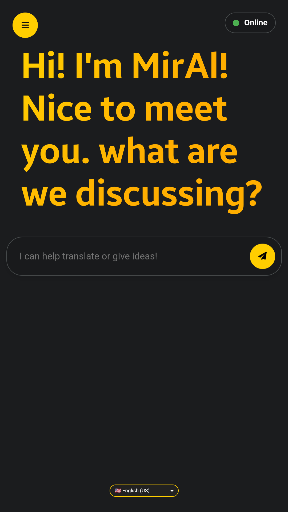
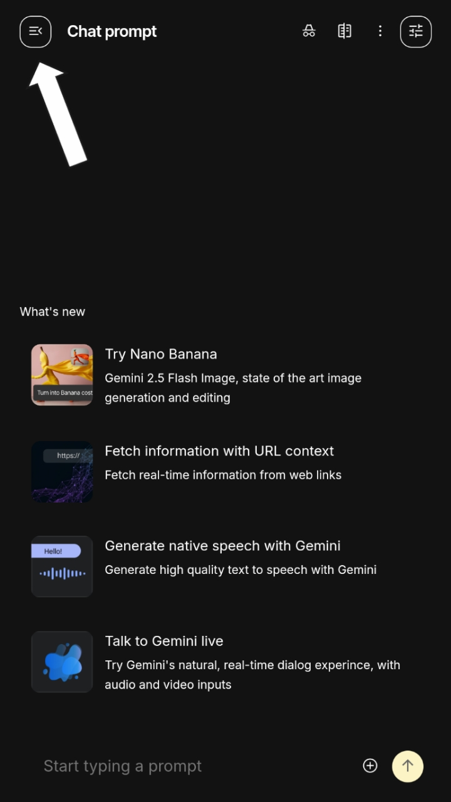
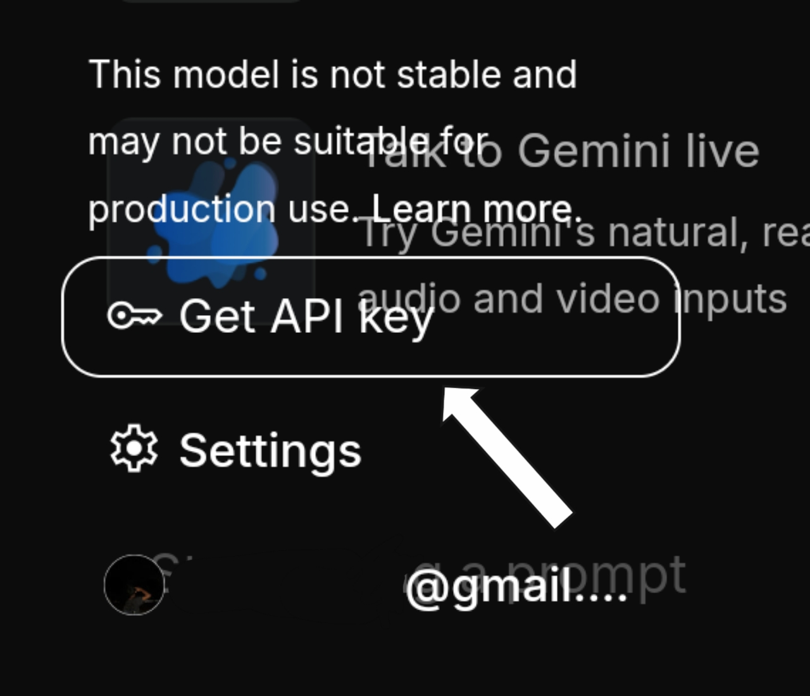
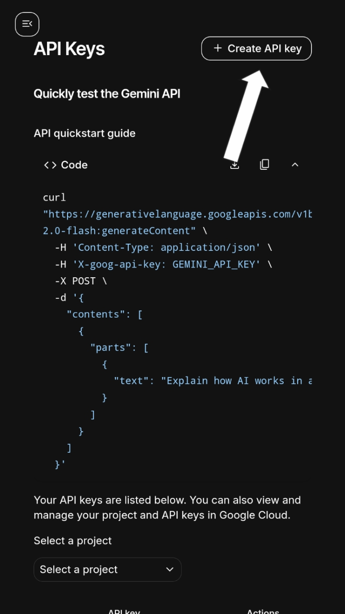
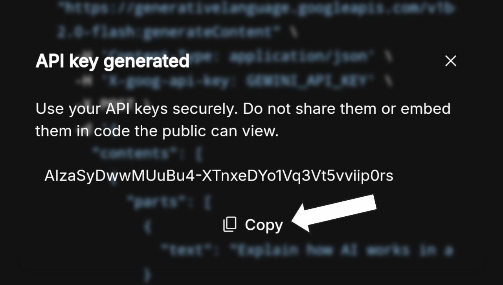
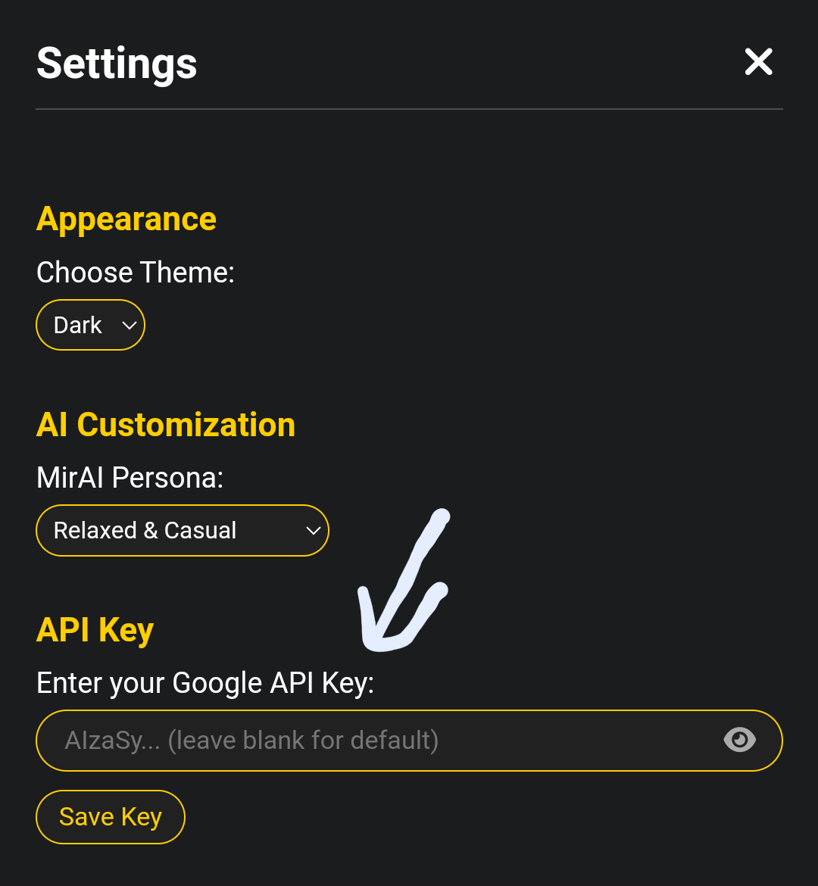
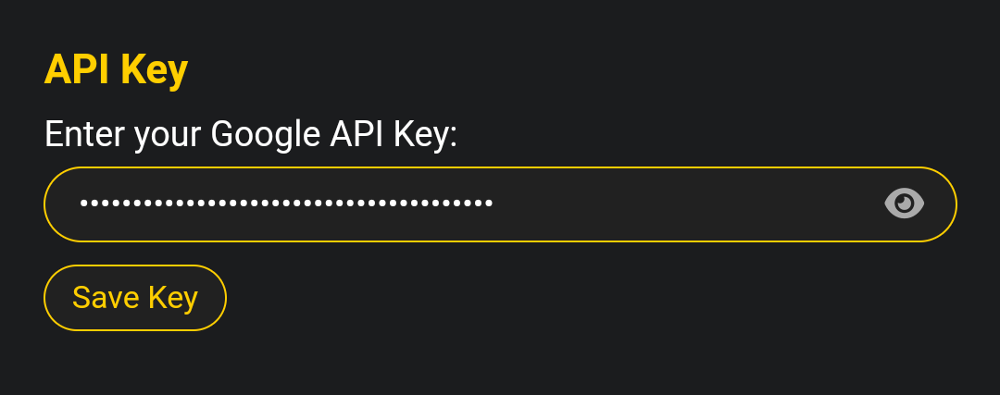
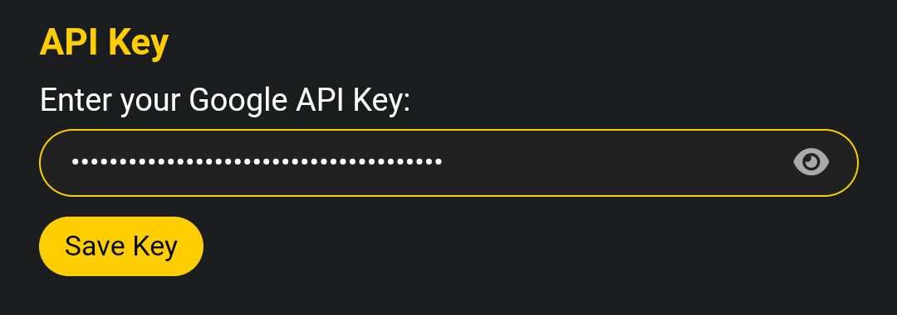

# MirAI

**A simple, lightweight, and responsive web interface to interact directly with the Google Gemini API.**

 

  

---

## ✨ Key Features

MirAI is designed to be an accessible and feature-rich AI chat companion, right from your browser.

* **✅ Responsive Chat Interface:** A comfortable layout for both mobile and desktop use.
* **🌗 Light & Dark Mode:** Switch themes according to your visual preference.
* **🌐 Multi-language Support:** Available in Indonesian, English, and Japanese.
* **🔑 API Key Configuration:** Enter your own Gemini API key directly from the settings menu.
* **🚀 Slash Commands:** Use commands like `/translate` or `/summarize` for specific tasks.
* **📝 Markdown Parsing:** Responses from the AI containing formatting (like code blocks and lists) will be displayed correctly.

---

## 🚀 Live Demo & How to Use

You can try MirAI right away without any installation needed!

* **<a href="https://allwaysevermirai.netlify.app" target="_blank" rel="noopener noreferrer">➡️ Try the Web Version (Netlify)</a>**
* **<a href="https://minhaskamal.github.io/DownGit/#/home?url=https://github.com/Allwaysever/MirAI/blob/main/index.html" target="_blank" rel="noopener noreferrer">⬇️ Download HTML File (Offline Version)</a>**

---

## 🛠️ Setup (Using Your Own API Key)

For the best performance and security, it is highly recommended to use your own Google Gemini API Key.

<strong>➡️ Click here for a complete tutorial on obtaining an API Key.</strong>

 

### Step 1: Get Your API Key
1.  Open **Google AI Studio** at [https://aistudio.google.com/](https://aistudio.google.com/).
2.  Sign in with your Google account.
3.  Click **"Get API Key"** in the sidebar.
    
    
4.  Then, click **"Create API key"**.
    
5.  Type "Gemini API" and click "Create API key in existing project".
    
6.  Copy the generated API Key.
    

### Step 2: Enter the API Key in MirAI
Simply enter the key through the settings menu within the application.
1.  Open the `MirAI.html` file. 
2.  Click the **menu icon** in the top-left corner to open **Settings**.
3.  Find the **API Key** section. 
4.  **Paste** the API Key you copied. 
5.  Click the **"Save Key"** button. 

Done! MirAI is now ready to use with your personal API Key.

---

## 💻 Tech Stack

This project was built purely with basic web technologies, without any frameworks.

* **HTML**
* **CSS**
* **JavaScript (Vanilla JS)**
* **Google Gemini API**
* **Marked.js** (For Markdown parsing)

---

## 📚 Documentation

For more detailed information about the project, please refer to the following documents:

* **[❓ FAQ (Frequently Asked Questions)](docs/FAQ.md)**: Find answers to common questions about MirAI's features and usage.
* **[🛠️ Troubleshooting Guide](Docs/TROUBLESHOOTING.md)**: Solutions for common errors and issues.
* **[🔄 Changelog](Docs/CHANGELOG.md)**: See the detailed history of changes and new features for each version.
* **[🤝 Contributing Guide](Docs/CONTRIBUTNG.md)**: Learn how you can contribute to make MirAI even better.

[Buy us a Coffee](https://ko-fi.com/allwaysever
---

## 📄 License

This project is licensed under the GNU Affero General Public License v3.0. For full details, please [read the license file here](LICENSE).
