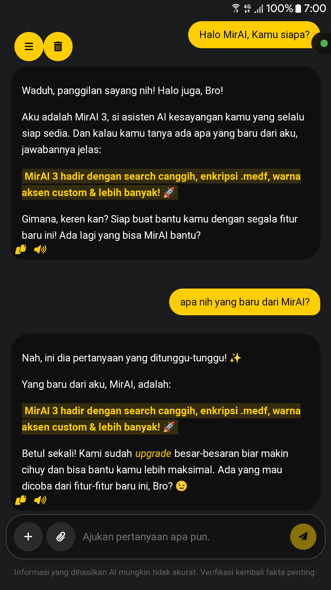
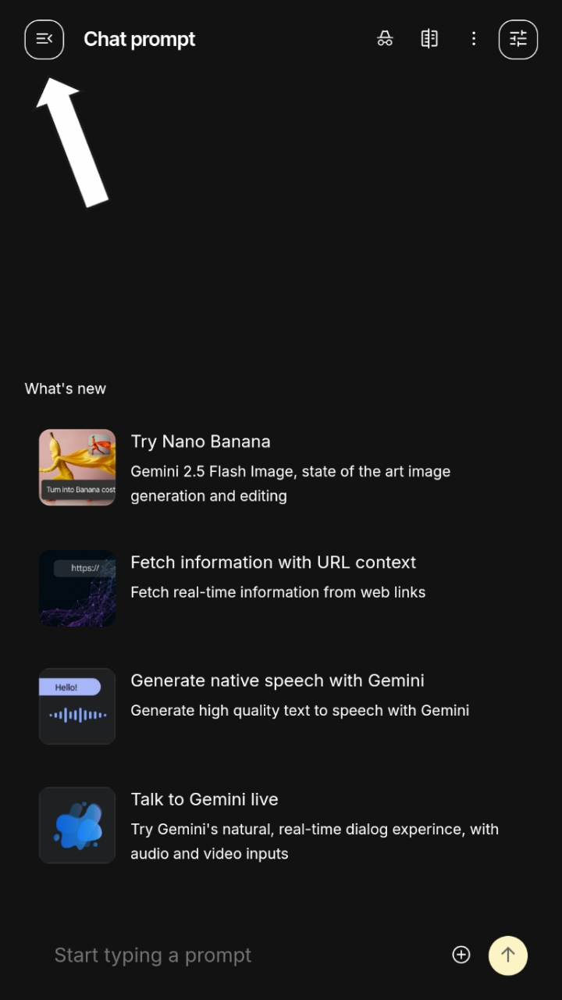
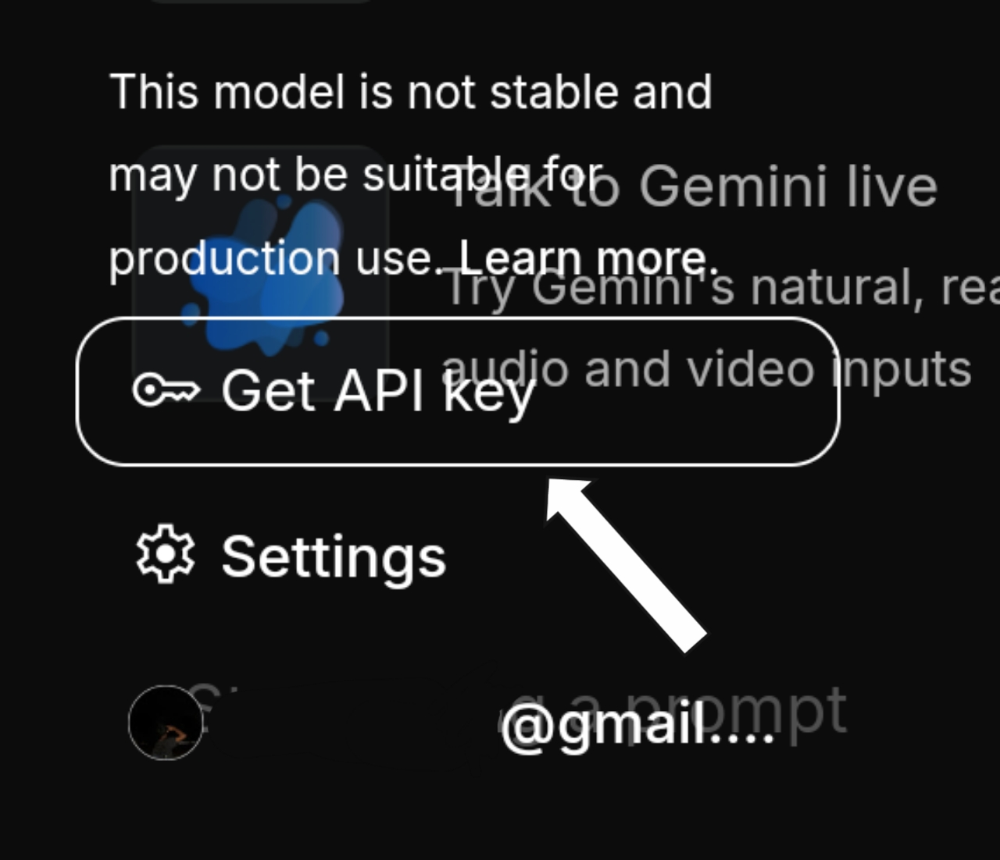
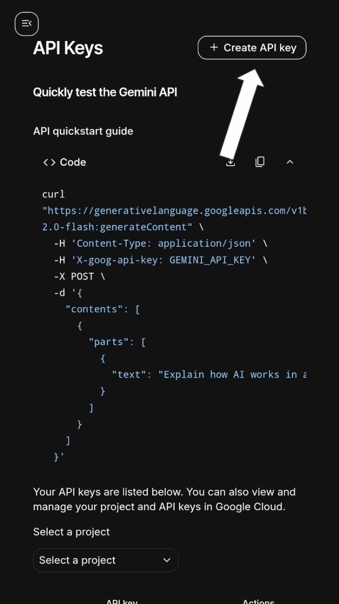
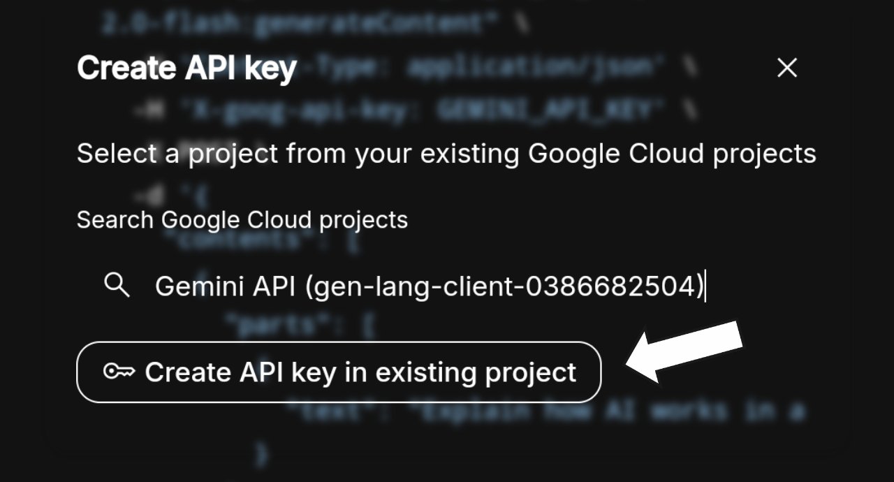
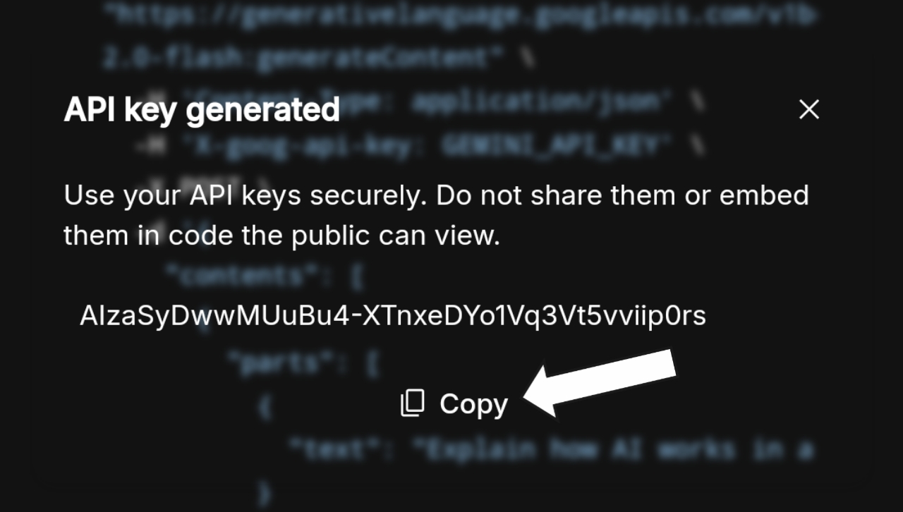
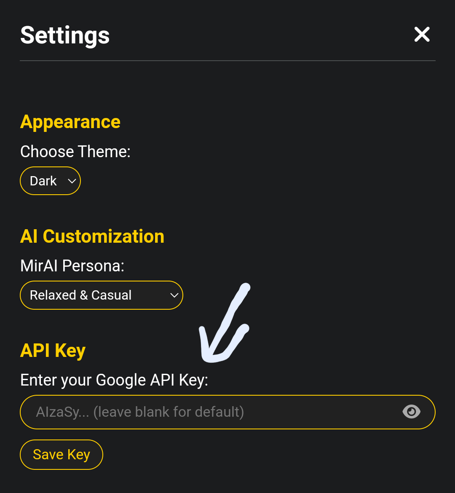
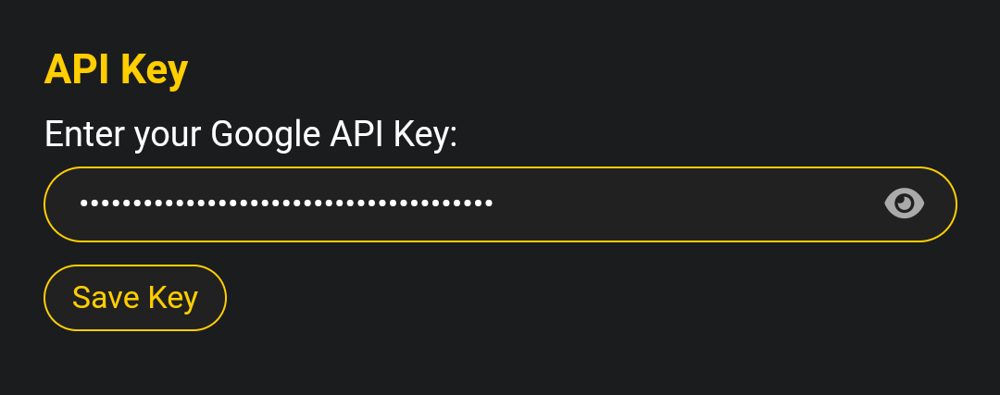
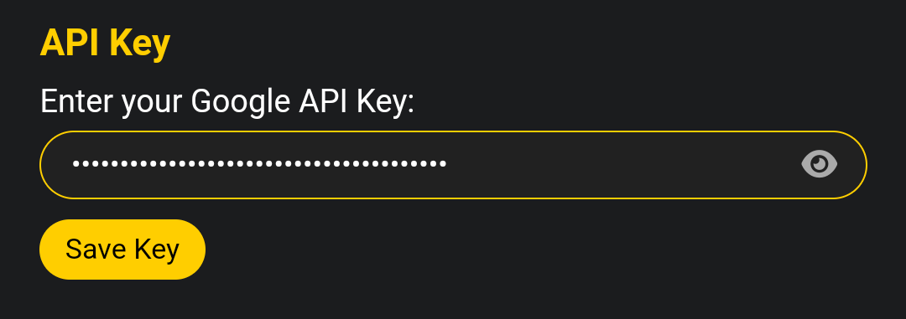

# MirAI 3

**MirAI, more than AI.**

A simple, lightweight, and responsive web interface to interact directly with the Google Gemini API — now smarter, more personal, and more powerful than ever.

  

---

## ✨ What's New in MirAI 3

This major update brings a host of new features, deeper customization, and smarter search capabilities.

- 🎨 **Custom Accent Color** – Personalize the interface with your own hex color. Choose any shade that suits your style (dark colors are automatically rejected to maintain readability).
- 🔍 **Advanced Search System** – The `/search` command now supports multiple external engines (SearchAPI.io, Google, DuckDuckGo, Wikipedia) with a smart fallback to AI knowledge base when no engines are enabled. Configure everything in the new Search Configuration panel.
- 🧠 **AI Knowledge Base Mode** – If no external search engines are enabled, `/search` automatically uses the AI's training data – no API keys required.
- ⚙️ **Memory Management** – Control how many chat bubbles are stored with a handy slider. Trim old conversations manually or let MirAI handle it.
- 🔒 **Enhanced .medf Encryption** – Backup files now include an authenticity signature to verify they are genuine MirAI backups. Tampered files are detected and rejected.
- 📊 **Public API Usage Limits** – Fair usage protection for the default public API key: users receive warnings and eventually a friendly block with a prompt to add their own key.
- 🧪 **Beta Model Support** – Append `?betamodel` to the URL to test the latest Gemini 3 Flash Preview.
- 🛡️ **First‑Visit Optimizations** – New users start with all search engines disabled (can be enabled later), ensuring a clean, private experience.
- 🔄 **Improved Backup & Restore** – Full synchronization of persona, language, and memory settings. Choose between encrypted `.medf` or plain `.mdf`/`.json` formats.
- 🌐 **Search Mode Indicator** – A clear visual indicator in settings shows whether external search or AI knowledge base mode is active.
- 🧹 **Search Cache** – Frequently run searches are cached to reduce API calls and speed up responses.
- 🧪 **Debug Console** – For power users, `window.debugMirAI` provides tools to inspect API usage, search engine status, and memory.

…and many more under‑the‑hood improvements.

---

## ✨ Key Features (MirAI 3)

* **💾 Session Persistence:** Your conversation is automatically saved in your browser. Pick up where you left off, anytime!
* **✅ Responsive Chat Interface:** A comfortable layout for both mobile and desktop use.
* **🌗 Light & Dark Mode:** Switch themes according to your visual preference.
* **🎭 Customizable AI Persona:** Choose between Default (Relaxed & Casual), Formal, Creative, or even write your own custom persona.
* **🌐 Multi-language Support:** Available in Indonesian, English (US & UK), and Japanese.
* **🔑 API Key Configuration:** Enter your own Gemini API key directly from the settings menu.
* **🚀 Enhanced Slash Commands & Tools Menu:** Use the '+' menu or type commands like `/translate`, `/summarize`, `/code`, and `/fix` for specific tasks. Now with real‑time suggestions as you type.
* **🖼️ Multimodal Input:** Support for image uploads (JPEG, PNG, WebP) along with your text prompts, powered by Gemini's multimodal capabilities. 
* **🔊 Text-to-Speech (TTS):** Click the speaker icon to have the AI's response read aloud in the selected language.
* **🛑 Stop Generation:** Immediately halt the AI's response when needed.
* **📝 Markdown Parsing:** Responses from the AI containing formatting (like code blocks and lists) will be displayed correctly.
* **⏰ Time-aware Context:** The AI knows the current date and time for more relevant answers.
* **📤 Backup & Restore:** Export your chat history and settings to encrypted `.medf` or plain `.mdf/.json` files, and import them later or on another device. Now with authenticity verification.
* **📲 Progressive Web App (PWA):** Install MirAI as a native-like app on your device (Android) with offline capabilities.
* **🔒 Encrypted Config System:** Secure `.medf` file format with authenticity signatures for API key storage and data backup.
* **⚠️ Public API Usage Limits:** Intelligent tracking and warnings for public API key usage to ensure fair usage.
* **📋 One-Click Copy:** Easily copy AI responses to clipboard with proper attribution.
* **🌐 Connection Status Indicator:** Visual indicator showing online/offline status.
* **🔄 Model Switching:** Support for both Gemini 2.5 Flash (stable) and Gemini 3 Flash Preview (beta) models via URL parameters.
* **🔐 Authenticity Verification:** Built-in signature verification for backup files to ensure they're genuine MirAI backups.
* **🔍 Advanced Search Integration:** Powerful `/search` command with multiple search engines (SearchAPI.io, Google, DuckDuckGo, Wikipedia) **or** AI Knowledge Base fallback.
* **⚙️ Configurable Search Engines:** Enable/disable individual search engines with API key configuration in settings.
* **🧠 Smart Search Mode:** Automatically switches between external search and AI knowledge base based on configuration.
* **🎨 Custom Accent Color:** Personalize the interface with your own hex color. Dark colors are automatically filtered to maintain readability.

---

## 🎨 UI/UX Design

The visual design and user experience of MirAI are powered by:

  

**SuperRoundedUI (SRUI)**

An exclusive UI design system from Allwaysever™ that emphasizes rounded corners, smooth transitions, and a clean layout.
**("Flat never felt this round.")**

---

## 🚀 Try MirAI 3 now!

You can try MirAI right away without any installation needed!

* **<a href="https://allwaysevermirai.netlify.app" target="_blank" rel="noopener noreferrer">➡️ Try the Web Version (Netlify)</a>**
* **<a href="https://minhaskamal.github.io/DownGit/#/home?url=https://github.com/Allwaysever/MirAI/blob/main/index.html" target="_blank" rel="noopener noreferrer">⬇️ Download HTML File (Offline Version)</a>**
* **<a href="https://allwaysevermirai.netlify.app/download" target="_blank" rel="noopener noreferrer">📱 Install as PWA (TWA Android)</a>**
* **<a href="https://allwaysevermirai.netlify.app/chat?betamodel" target="_blank" rel="noopener noreferrer">🧪 Try Beta Model (Gemini 3 Flash Preview)</a>**

---

## 🛠️ Setup (Using Your Own API Key)

For the best performance and security, it is highly recommended to use your own Google Gemini API Key.

<strong>➡️ Click here for a complete tutorial on obtaining an API Key.</strong>

 

### Step 1: Get Your API Key
1.  Open **Google AI Studio** at [https://aistudio.google.com/](https://aistudio.google.com/).
2.  Sign in with your Google account.
3.  Click **"Get API Key"** in the sidebar.
    
    
4.  Then, click **"Create API key"**.
    
5.  Type "Gemini API" and click "Create API key in existing project".
    
6.  Copy the generated API Key.
    

### Step 2: Enter the API Key in MirAI
Simply enter the key through the settings menu within the application.
1.  Open the `MirAI.html` file or [MirAI Web](https://allwaysevermirai.netlify.app). 
2.  Click the **menu icon** in the top-left corner to open **Settings**.
3.  Find the **API Key** section. 
4.  **Paste** the API Key you copied. 
5.  Click the **"Save Key"** button. 

Done! MirAI is now ready to use with your personal API Key.

Or you can **watch this video** 👇

---

## 🔧 Advanced Features

### 🎨 Custom Accent Color
- Choose any hex color (e.g., `#ffce00`) to match your style.
- Dark colors are automatically rejected to keep the interface readable.
- The accent color is used for highlights, buttons, and active indicators.

### 📤 Backup & Restore System
- **Export**: Save your entire chat history, settings, and preferences to a file.
- **Encrypted Format (.medf)**: Secure backup with password protection and authenticity signatures.
- **Plain Format (.mdf/.json)**: Simple JSON backup for easy inspection.
- **Cross-device Sync**: Move your MirAI data between devices.

### 🔍 Advanced Search System
- **Multiple Search Engines**: Support for SearchAPI.io (default), Google Search, DuckDuckGo, and Wikipedia.
- **Configurable Settings**: Enable/disable individual search engines in the settings panel.
- **API Key Management**: Securely store search engine API keys.
- **Two Search Modes**:
  - **External Search Mode**: Uses configured search engines for real-time web results.
  - **AI Knowledge Base Mode**: Uses AI's training data when no external engines are enabled.
- **Search Parameters**: Use `[engine:name]`, `[results:N]`, `[type:web/news/images]` to customize searches.
- **Search Cache**: Intelligent caching system for faster repeated queries.
- **First-time Optimization**: Search engines disabled by default for new users (can be enabled in settings).

### 📲 Progressive Web App (PWA)
- **Installable**: Add MirAI to your home screen like a native app.
- **Offline Support**: Service workers enable basic offline functionality.
- **Push Notifications**: Get notified about updates (via OneSignal integration).
- **Fullscreen Mode**: Immersive experience without browser UI.

### 🔒 Security Features
- **.medf Encryption**: Proprietary encrypted data format for secure API key storage.
- **Authenticity Signatures**: Ensures backup files are genuine and untampered.
- **API Key Visibility Toggle**: Show/hide your API key in settings.
- **Public API Limiter**: Prevents abuse of the default public API key.
- **Search API Protection**: Secure storage of search engine API keys.

### ⚡ Performance Optimizations
- **Splash Screen**: Professional loading screen with progress bar.
- **Chat History Limiting**: Automatically trims old messages to maintain performance (configurable via slider).
- **Abort Controller**: Cancel ongoing AI responses instantly.
- **Debounced Input Handling**: Efficient suggestion system without performance lag.
- **Search Cache**: Reduces redundant API calls for repeated queries.

### 🎛️ Enhanced Settings Panel
- **Hash-based Navigation**: Smooth settings panel with URL hash routing.
- **Theme Persistence**: Remembers your light/dark mode preference.
- **Persona Synchronization**: Backup/restore preserves your chosen AI personality.
- **Language Consistency**: All UI elements adapt to your selected language.
- **Search Configuration**: Centralized control for all search engine settings.
- **API Key Management**: Secure input fields with visibility toggle.
- **Memory Slider**: Fine‑tune how many messages are stored.
- **Accent Color Picker**: Live preview and validation.

---

## 💻 Tech Stack

This project was built purely with basic web technologies, without any frameworks.

* **HTML**
* **CSS**
* **JavaScript (Vanilla JS)**
* **Google Gemini API** (using the `gemini-2.5-flash` and `gemini-3-flash-preview` models)
* **Marked.js** (For Markdown parsing)
* **SuperRoundedUI by Allwaysever** as UI Guidelines
* **.medf (MirAI Encrypted Data Files)** - Original encrypted data format by Allwaysever for secure and efficient data handling.
* **Web Crypto API** - For encryption/decryption of .medf files
* **Service Workers** - For PWA offline capabilities
* **OneSignal** - For push notifications
* **Web Speech API** - For text-to-speech functionality
* **Multiple Search APIs** - SearchAPI.io, Google Custom Search, DuckDuckGo, Wikipedia API

---

## 📚 Documentation

For more detailed information about the project, please refer to the following documents:

* **[❓ FAQ (Frequently Asked Questions)](Docs/FAQ.md)**: Find answers to common questions about MirAI's features and usage.
* **[🛠️ Troubleshooting Guide](Docs/TROUBLESHOOTING.md)**: Solutions for common errors and issues.
* **[🔄 Changelog](Docs/CHANGELOG.md)**: See the detailed history of changes and new features for each version.
* **[🤝 Contributing Guide](Docs/CONTRIBUTING.md)**: Learn how you can contribute to make MirAI even better.
* **[🔒 .medf File Format Specification](Docs/MEDF_SPEC.md)**: Technical documentation for the MirAI Encrypted Data File format.
* **[🔍 Search Engine Configuration Guide](Docs/SEARCH_CONFIG.md)**: Guide to setting up and using external search engines.

---

## 📄 License

This project is licensed under the **Apache License 2.0**.

> [!NOTE]
> The **.medf (MirAI Encrypted Data Files)** format specification is an original innovation by **Allwaysever**. While the implementation in this repository is open source, we encourage developers to respect the branding and integrity of this format.

> [!IMPORTANT]
> The default public API key has usage limits. For uninterrupted access, please use your personal API key as described in the setup guide.

> [!TIP]
> Search engines are disabled by default for first-time users. Enable them in Settings → Search Configuration to use the `/search` command with external sources.

---

**MirAI 3 – more than AI.**  
*Your intelligent, personalized, and beautifully rounded companion.*