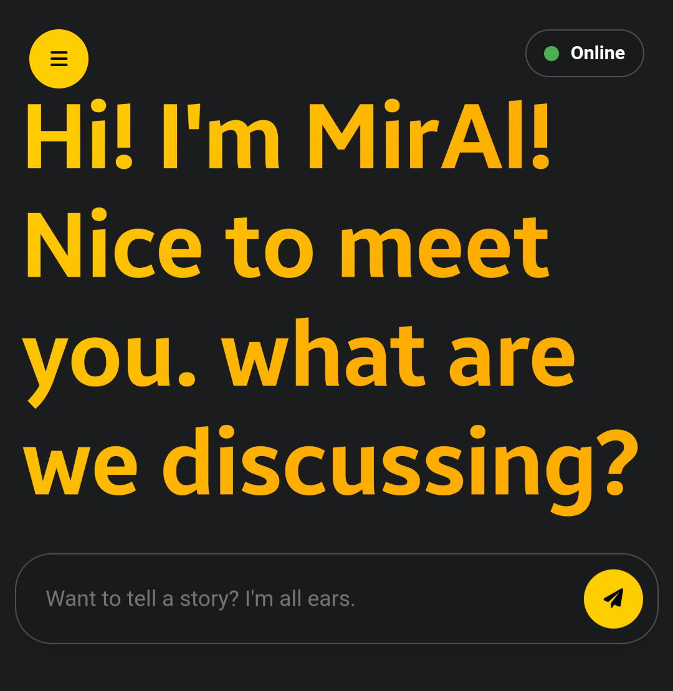
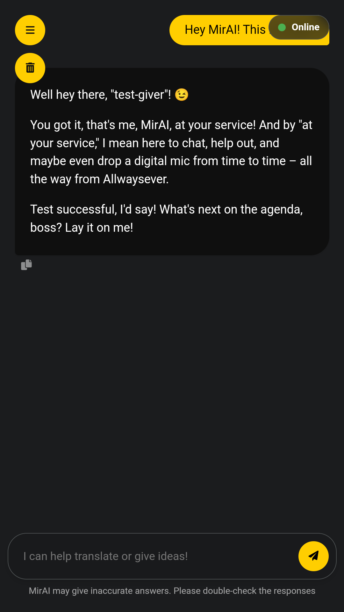

[Download](https://rawcdn.githack.com/Allwaysever/MirAI/be80c02bf26fb8f624504c8966ce53d38ce1454a/MirAI.html)

## 🛠️ How to Get Started

You can actually use the API key from Alwaysever. But for security and to prevent misuse, I recommend using your own API key. Here's the tutorial.

### Step 1: Get Your API Key

1.  Go to **Google AI Studio** at [https://aistudio.google.com/](https://aistudio.google.com/).
2.  Sign in with your Google account.
3.  Once you're in, click **"Get API Key"** in the sidebar.
    
    
4.  Then, click **"Create API key"**.
    
5.  Type "Gemini API" and click "Create API key in existing project".
    
6.  Copy the generated API Key.
    

### Step 2: Input the API Key in MirAI

Thanks to the new feature, you no longer need to edit the HTML file. Simply enter the key through the in-app settings.

1.  Open the `MirAI.html` file in your browser (Google Chrome, Firefox, etc.). 
2.  Click the **menu icon (three lines)** in the top-left corner to open **Settings**.
3.  Find the **API Key** section. 
4.  **Paste** the API Key you copied into the provided field. 
5.  Click the **"Save Key"** button. 

That's it! MirAI is now ready to use with your personal API Key. Have fun chatting with the AI!

## 📚 Technical Details

* **API**: Google Gemini API
* **Application**: Single-page application (HTML, CSS, and JavaScript)
* **Features**:
    * Responsive chat interface
    * Light and dark mode support
    * Support for multiple languages (Indonesian, English, Japanese)
    * Ability to copy text from AI chat bubbles
    * In-app API Key configuration

## 📄 License

This project uses the ACL v5.1 license. For full details, please [read the license file here](Licences/ACLICENSE_EN.md). if you are Indonesian, you can [read this license](Licences/ACLICENSE_ID.md).
